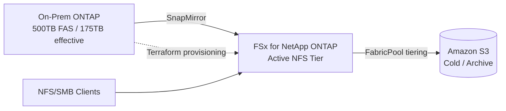

# Hybrid Cloud Migration Plan — Sample Output

> Representative output of the crew for the default sample inputs. Regenerate with
> `crewai run`. Figures come from the deterministic `storage_cost_calculator` tool;
> narrative is produced by the agents.

**Inputs**
- Storage configuration: ONTAP cluster with 500 TB FAS, 70% utilization, heavy NFS workloads, dedup ratio 2:1
- Workload profile: Mixed hot/cold data, frequent access to 20%, archival 80%, expected 15% annual growth

## Executive Summary

The on-prem ONTAP cluster holds ~350 TB of used capacity (500 TB raw at 70%
utilization), reducing to **175 TB effective** after 2:1 deduplication. The workload
is NFS-heavy, so object storage is not a drop-in target — preserving NFS/SMB semantics
and ONTAP features requires a NetApp-managed file service. Among those, **Amazon FSx
for NetApp ONTAP (FSxN)** delivers the lowest 3-year TCO and is the recommended target.
With **NetApp FabricPool cold-tiering** enabled (80% archival data tiered to low-cost
object storage), FSxN's 3-year TCO drops from ~$502K to **~$362K** — within ~12% of
pure object storage while keeping full NFS/SMB and ONTAP capability.

## Storage Analysis

- Raw capacity 500 TB; used ~350 TB; effective ~175 TB after 2:1 dedup.
- 80% of data is archival/cold — a strong candidate for FabricPool tiering to object
  storage even if the active tier stays on managed ONTAP.
- Heavy NFS access pattern; 20% hot data drives egress/performance requirements.
- Optimization triggers: rising utilization (>70%) and 15% annual growth warrant a
  hybrid-cloud target rather than an on-prem refresh.

## Cost Comparison (3-Year TCO)

Methodology: sized on effective (post-dedup) capacity; capacity grows at 15%/yr
compounded **monthly** over 36 months; monthly egress = effective capacity × 20% hot
× 1.0 turnover × egress rate. US-East list prices as of 2026-06. **FabricPool tiering
ON**: managed-file targets keep hot data on the performance tier and tier the 80% cold
data to the object-storage capacity tier (AWS S3 rate). Excludes API/request charges,
retrieval/early-delete fees, snapshot/backup capacity, and support — see the tool's
`EXCLUDED_FROM_MODEL` note.

| Provider | Type | FabricPool | Initial Monthly | 3-Year TCO |
|---|---|:--:|---:|---:|
| Google Cloud | Object Storage | — | $6,451 | $286,837 |
| Azure Blob | Object Storage | — | $6,810 | $302,772 |
| AWS S3 | Object Storage | — | $7,347 | $326,675 |
| **FSx for NetApp ONTAP** | **NetApp Managed File** | ✓ | **$8,136** | **$361,733** |
| CVO | NetApp Managed File | ✓ | $8,673 | $385,636 |
| Azure NetApp Files (Std) | NetApp Managed File | ✓ | $12,150 | $540,209 |

(Without tiering, the managed-file TCOs are higher — e.g. FSxN $501,964, CVO $621,480,
ANF $1,330,604. Toggle tiering off in the UI or via `enable_tiering=false`.)

**Recommendation:** FSx for NetApp ONTAP. Object storage is cheaper but cannot serve
the NFS workload natively. FSxN is the lowest-cost NetApp-managed option that preserves
ONTAP features (snapshots, SnapMirror, dedup) and NFS/SMB access, and with FabricPool
tiering its TCO lands within ~12% of object storage — a strong case for keeping ONTAP
capabilities without a major cost premium.

## Phased Migration Plan

1. **Assess & Design** — inventory volumes/exports, confirm protocol and SLA needs,
   provision FSxN file systems via Terraform.
2. **Seed & Replicate** — establish SnapMirror from on-prem ONTAP to FSxN; baseline
   transfer then incremental syncs.
3. **Validate** — checksum integrity, mount NFS exports in a staging environment,
   verify performance against SLAs.
4. **Cutover** — quiesce writes, final SnapMirror update, repoint clients to FSxN.
5. **Optimize** — enable FabricPool tiering of cold blocks to S3; decommission on-prem.

**Tools:** Terraform (provisioning), SnapMirror (replication/cutover vehicle),
NetApp Cloud Manager, AWS DataSync (heterogeneous data if needed).

**Key risks & mitigations:** data-integrity gaps (checksum validation), cutover
downtime (incremental SnapMirror to minimize final delta), cost overrun on egress
(tier cold data, monitor with budgets).

**Rollback:** retain on-prem source read-only until validation completes; clients can
revert to original NFS exports if cutover validation fails.

## Architecture

